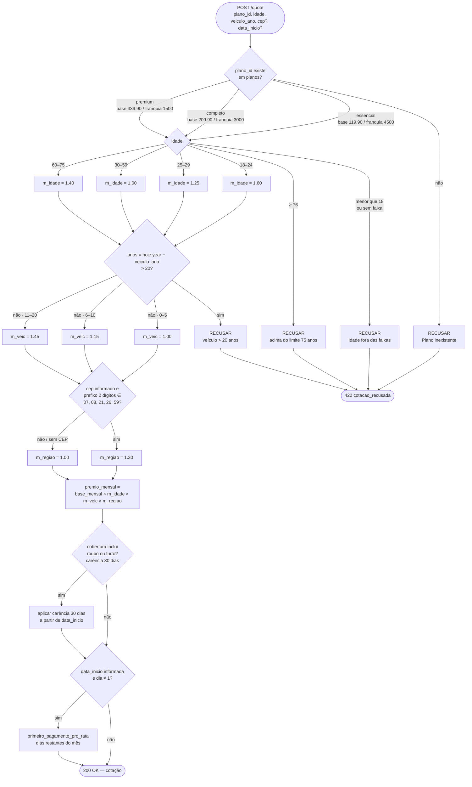

# Árvore de decisão — regras de `planos.json`

Fonte canônica: `quote-service/data/plans.json` (mesma lógica de `quote_logic.cotar`).

**Visualização no browser:** abra [`arvore-decisao-planos.html`](./arvore-decisao-planos.html).

**Archify do fluxo POST /quote:** [`fluxo-quote.sequence.html`](./fluxo-quote.sequence.html) (fonte: [`fluxo-quote.sequence.json`](./fluxo-quote.sequence.json)).

Fluxo: validar plano → faixa etária → idade do veículo → região CEP → prêmio → carência (roubo/furto) → pro-rata.

## Planos (folha de preço)

| id | nome | base_mensal | franquia | coberturas |
|---|---|---:|---:|---|
| essencial | Essencial | 119.90 | 4500 | colisao, roubo, furto |
| completo | Completo | 209.90 | 3000 | + terceiros, vidros |
| premium | Premium | 339.90 | 1500 | + carro_reserva, assistencia_24h |

## Multiplicadores

**Faixa etária:** 18–24 ×1.60 · 25–29 ×1.25 · 30–59 ×1.00 · 60–75 ×1.40 · ≥76 recusa  
**Idade veículo:** 0–5 ×1.00 · 6–10 ×1.15 · 11–20 ×1.45 · **> 20 recusa** (um único critério)  
**CEP alto risco** (prefixos `07/08/21/26/59`): ×1.30 · senão ×1.00  
**Carência:** se cobertura inclui roubo/furto → 30 dias a partir de `data_inicio`; senão, sem essa carência
